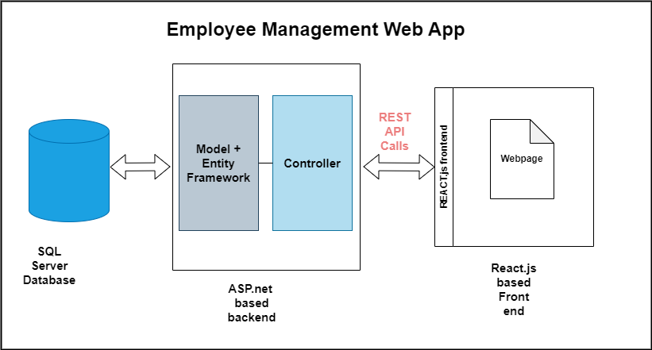

# Employee Management System : Basic CRUD Operations Demo
## Azure Deployment Details
### Access the frontend React.js application at : https://employee-management-frontend-gwcwfxcrbga9enak.eastus-01.azurewebsites.net
### Access the ASP.NET web API service at : https://employee-management-demo-evbgc5g0b8d7h2cw.eastus-01.azurewebsites.net

## Instructions to Run the App locally
#### Step 1 : Set up the Database 
- Download SQL server (SQL Express) and Server Studio.
- Create Database **EmployeesEID**
- In Visual Studio (VS), open server explorer and connect to the database.
- Take the **connectionstring** of the 'EmployeesID Database' and replace the string in DefaultConnection in the appsettings.json
- In the connectionString make keep Trust Certificate = True as we are hosting it locally
- Create table in database by running migration: Run in package manager console: - **Add-Migration MigrationName**, **Update-Database**
- Check in studio if the database table 'EmployeeTable' exists
- Insert Sample data to database : In Server Explorer, for the database, run the sample query provided in documentation.

#### Step 2: Start the backend Server.
- Install in nuget package manager:EntityFramework.Core.sqlserver, EntityFramework.Core.Tools
- Click on Run 'http' to start the server, the server runs in http://localhost:5238/

#### Step3: Start React server:
- Go to the employee-fe-app folder and run "npm Install" to install dependencies and run "npm start" to start the server
- the frontend application will run in http://localhost:3000/

## Running Unit Tests 
I have used inMemory database to run the unit Test cases for basic CRUD operations testing.

**Steps to run unit test cases:**
- Go to solutions -> nuget manager -> Install in EmployeeManagement.Tests the packages: xunit, xunit.runner , moq, Microsoft.EntityFrameworkCore.InMemory 
- Build the Solution: Make sure your solution builds successfully by clicking on **Build** > **Build Solution** or pressing Ctrl+Shift+B.
- Run Tests: Go to **Test** > **Test Explorer** in Visual Studio. Click on **Run All** to run all the tests in your solution.
- Alternatively, you can right-click on individual test methods and select **Run**.	

## Testing using Postman
- Download the collection **EmployeeManagement_API_Testing.postman_collection** 
- Import this collection to postman from where you can test web API locally as well as the one deployed on Azure.
